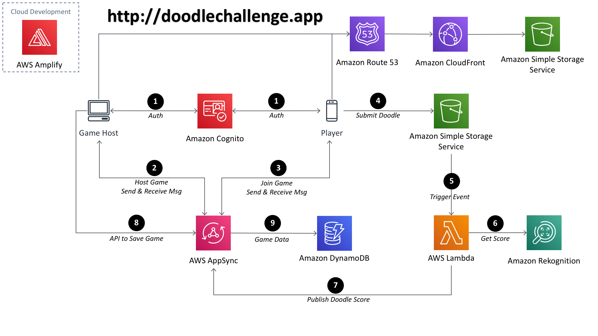

# Project Overview
   Doodle Challenge is a multi-player game enabling you to compete against your fellow players, to see who can create the best doodles of a given subject.  You will need 1 host and at least 2 players to enjoy the game. The host and the players should be in the physical room to play.
   To see a live demo go to https://doodlechallenge.app/


# Project Abstract
   Players are invited to sketch various objects (e.g. a bird, a pair of spectacles, a car) against the clock, and each effort is automatically analysed and scored out of 100. The highest total score at the end of six rounds wins. The hub of the project is AWS Rekognition, the AWS service used to identify and classify images, based on a branch of Artificial Intelligence (AI) called Machine Learning (ML). The score given for each doodle is an indicator of Rekognition's confidence in its identification of the doodle. The project was implemented using entirely serverless technologies from AWS.


# Architecture


# Environment setup
Doodle Challenge uses a number of libraries to work properly:
* [AWS Amplify] - Unified toolchain to create, integrate, and manage the AWS cloud services.
* [Node.js] - Event-driven JavaScript runtime.
* [React] - A JavaScript library for building user interfaces.
* [Material-ui] - React components
* [AWS SDK] - Command Line Interface to manage your AWS services.

# Installation
Install Nodejs version 8.x or greater and npm version 5.x.
> Verify that you are running at least Node.js version 8.x or greater and npm version 5.x or greater by running node -v and npm -v in a terminal/console window.

Install and configure the amplify cli
```sh
$ npm install -g @aws-amplify/cli
$ amplify configure
```

Go into the Doodle Challenge repo directory
```
$ cd doodlechallenge
```

Install the dependencies
```
$ npm install
```

# Add AWS Services
Add authentication to allow hosts and players to interact with AWS services. (https://aws-amplify.github.io/docs/js/authentication)
```
$ amplify add auth
$ amplify push
```
---

Add Appsync API. This is a managed graphql service. (https://aws-amplify.github.io/docs/js/api)
```
$ amplify add api
? Please select from one of the below mentioned services (Use arrow keys)
❯ GraphQL
  REST
```
```
? Choose an authorization type for the API (Use arrow keys)
  API key
❯ Amazon Cognito User Pool
```
```
$ amplify push
```
The graphql schema is available in the amplify/auth directory of this repository

---

Add a lambda function.
```
$ amplify add function
$ amplify push
```
---

Add AWS Rekognition which will grab the image and make a call to AWS Rekognition for image label detection. (https://aws-amplify.github.io/docs/js/predictions)
```
$ amplify add predictions
$ amplify push
```

---
Add S3 storage (https://aws-amplify.github.io/docs/js/storage)
```
$ amplify add storage
$ amplify push
```

# Running the game

Run locally
```
$ npm start
```

This should open your browser to http://localhost:3000

# FAQ
### Q:  Do I need to be able to draw?
A:  No, you do not need to be able to draw. If your sketch is of low quality, it may still be recognized, and given a low score. All part of the fun.

### Q:  How does it do it?
A:  Using AWS Rekognition Image, a deep learning powered image recognition service that detects objects, scenes, and faces.

### Q:  What is Machine Learning?
A:  Machine Learning is a branch of artificial intelligence based on the idea that systems can learn from data, identify patterns and make decisions with minimal human intervention.

### Q:  How long did it take to produce Doodle Challenge?
A:  The developers spent around six weeks conceptualizing and implementing Doodle Challenge.

### Q:  Can I reuse this code in my own project?
A:  Yes you can! The demo uses licensed fonts and images that we have excluded. You will need to use your own licensed fonts and images.


# Authors
- Howard Tran, Enterprise Solutions Architect, AWS hwrd@amazon.com
- Jeff Richards, Solutions Architect, AWS jjefr@amazon.com

# License #
This library is licensed under the Apache 2.0 License.

[AWS Amplify]: <https://aws-amplify.github.io/docs/>
[Node.js]: <https://nodejs.org/en/>
[React]: <https://reactjs.org/>
[Material-ui]: <https://material-ui.com/>
[AWS SDK]: <https://aws.amazon.com/cli/>
