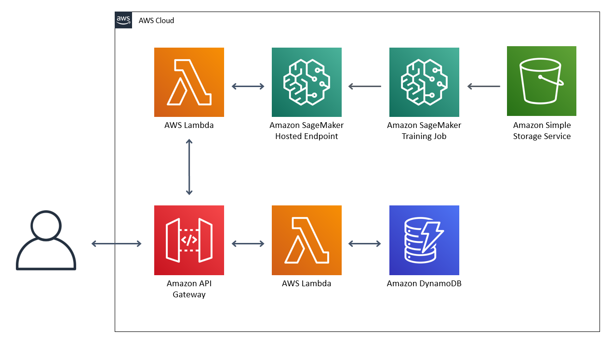

# Puente

Puente is a machine learning model that recognizes static American Sign Language letters. The model is placed behind an API to allow developers to build their different applications on without having to learn machine learning. 

# Architecture

# Project Details
There are three parts to creating this user experience:

	Data collection
	Model Building
	Frontend application

## Data Collection
The foundation of American Sign Language is the static alphabet. The other aspect of ASL is the dynamic signs that involve movement. Many of these dynamic signs use the hand shapes from static alphabet as a basis for the sign, so we set out to build that model. Unfortunately, the accessibility of a quality ASL alphabet dataset is limited. When we trained with some of these pre-existing datasets, the model predicted the wrong letter with a high-level confidence, which led us to do our own data collection. We captured ten different hands for each letter at three different angles with two lightings at two different distances, totaling 440 pictures per letter. Our current dataset has 2,640 pictures. To aid others who want to use ASL based dataset, we are looking at public options to share our dataset. In addition, we are attempting to address the scaling of the dataset by looking at splicing videos and data creation sources. We want to focus on laying the foundation with this dataset so adding other more data will continue to improve the confidence of the model.

## Model Building
Once we had quality data, we began training our model. To do this, we utilized Amazon SageMaker and the built-in image classification algorithm. We used Amazon SageMaker notebooks extensively through the model building and training process. Starting with the default value of the parameters, our model detected the correct letter with a confidence level of .9219 in front of neutral backgrounds. We wanted our model to work with busier backgrounds. This is where we used Amazon SageMaker Hyperparameter Tuning to help us find the optimized parameters to address both background types. We found three parameters that influenced the accuracy and confidence of our model:

	Use pretrained model – enables transfer learning
	Batch size -- the number of images to analyze before updating a model’s weights
	Learning rate -- the rate at which our model learns the features of our data
	
With the help of the tuning job, the newly optimized model accurately predicted the correct letter with a confidence level of .9128 in front of busier background. The best results, as expected, are with neutral backgrounds as they predicted at higher confidence levels. 

## Game Application
The first layer of our application is the interface. The first page of the interface is a sign-in page where users can register and join a match. The players see a wait screen until the match has two players. Once the match is full, the page displays what the camera sees as well as a target word to fingerspell. The frontend uses the React framework to compose the interface. Our React app uses the laptop’s camera to capture the external environment to send back to our model. The interface then displays the response from our model. 

Our model is hosted on a managed Amazon SageMaker Endpoint. The application hits API Gateway, which triggers a lambda function to interact with our ML model. The lambda function then returns the prediction from our model. Our endpoint is on C5.large instance, which is burstable in nature to scale with traffic. 

The matchmaking logic is hosted in a lambda function that interacts with DynamoDB. The user connects to the application through API Gateway, which connects to lambda through web sockets. After the connection is established, the lambda function writes to the DynamoDB table with the username as well as the connection ID. The DynamoDB table keeps track of what users are in a match and will continually update the word count for each user in the match. 
